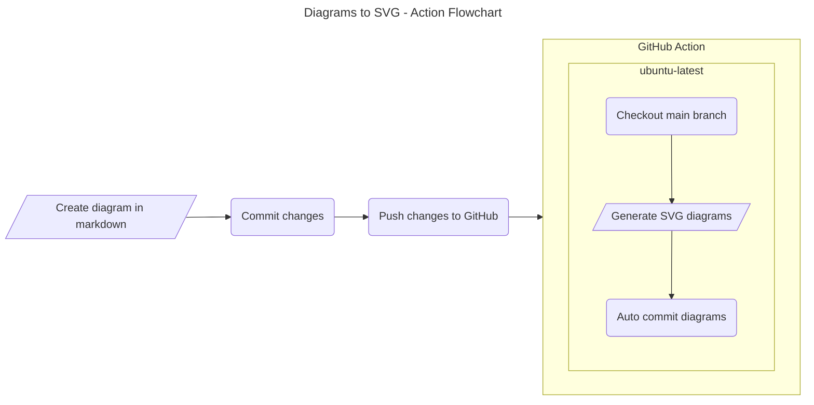

# GitHub Action: Convert Mermaid Diagrams In Markdown To SVG

```mermaid
---
title: Diagrams to SVG - Action Flowchart 
---
flowchart LR
    create[/Create diagram in markdown/]
    commit(Commit changes)
    push(Push changes to GitHub)

    create --> commit
    commit --> push
    push --> action

    subgraph action[GitHub Action]
      direction LR

      subgraph ubuntu-latest
        direction TB
        checkout(Checkout main branch)
        generate[/Generate SVG diagrams/]
        auto-commit(Auto commit diagrams)

        checkout --> generate
        generate --> auto-commit

      end
    end
```